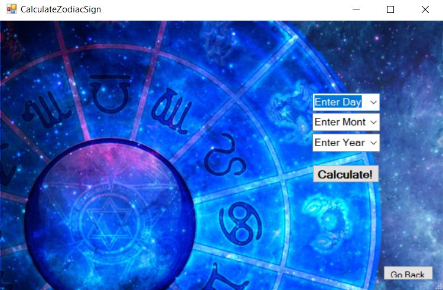

# Astrology-Project

Windows Forms Project by: Tijana Pandevska and Nikola Ristov 

[Македонски](#) 

##1. Опис на апликацијата

Името на оваа апликација е Astrology и истата има за цел да го пронајде хороскопскиот знак на корисникот, неговиот подзнак и трет знак. Исто така, оваа апликација прикажува и дневен, месечен и годишен хороскоп за корисникот во зависност од неговиот пронајден знак.

##2. Упатство за користењe

###2.1 Започнување од почеток

При првото отварање на апликацијата иницијално имаме едно dropdown мени каде корисникот може да го избере соодветниот хороскопски знак доколку го знае иститот, при што му се пројавува една лабела на која го пишува избраниот знак.

Доколку корисникот не го знае неговиот хороскопски знак имаме можност да го пресметаме истиот..
За таа цел имаме 3 копчиња доле:
Calculate Zodiac Sign  - за наоѓање на хороскопски знак
Calculate Moon Sign - за наоѓање на подзнак
Calculate Ascending Sign - за наоѓање на трет знак

Имаме и можност за избор на преглед на хороскоп преку 3 копчиња:
Daily Horoscope - за преглед на дневен хороскоп
Weekly Horoscope - за преглед на неделен хороскоп
Yearly Horoscope - за преглед на годишен хороскоп

###2.3 Најди хороскопски знак 

За наоѓање на хороскопски знак корисникот треба да кликне на копчето Calculate Zodiac Sign.

При кликање на ова копче ќе му се отвори нова форма каде ќе може да ги внесе денот, месецот и годината на раѓање и со прпетискање на копчето Calculate, корисникот се враќа на почетната форма каде има плус една лабела на која го пишува неговиот знак.

На следната слика е прикажан изгледот на почетната страна после пресметувањето на хороскопскиот знак.

###2.4 Преглед на дневен/неделен/годишен хороскоп.

При претискање на копчето DailyHoroscope на почетната страна ни се отвара нова форма - проозорец, на која го пишува името на избраниот или пресметаниот хороскопски знак и информации на дневна основа за истиот.

На следната слика е даден приказ, како изгледа тоа за хороскопсиот знак Водолија

##3. Претставување на проблемот

###3.1 Податочни структури

Главните податоци и функции за играта се чуваат во класа public class ZodiacSign и оваа класа е задолжена да го пронајде хороскопскиот знак и за тоа содржи функција setZodiac();
Имаме и уште две класи MoonSign Class и AscendingSign Class кои се задолжени за пронаоѓање на подзнак и трет знак.

Исто така имаме класи и за DailyHoroscope, WeeklyHoroscope и YearlyHoroscope кои во себе содржат податоци и опис за содржината на хороскопите и инстанца од класата ZodiacSign();

####3.1.1 ZodiacSign class

    public class ZodiacSign
    {
        public String sign { get; set; }
        public static readonly List<String> Signs = new List<String> {
            "Aries",
            "Taurus",
            "Gemini",
            "Cancer",
            "Leo",
            "Virgo",
            "Libra",
            "Scorpio",
            "Sagittarius",
            "Capricorn",
            "Aquarius",
            "Pisces"
        };

        public DateTime dateOfBirth { get; set; }

        public ZodiacSign()
        {

        }

        public void setZodiac(DateTime dateOfBirth)
        {
            if ((dateOfBirth.Month == 3 && dateOfBirth.Day >= 20) || (dateOfBirth.Month == 4 && dateOfBirth.Day <= 19))
            {
                this.sign = Signs[0];
            }
            else if ((dateOfBirth.Date.Month == 4 && dateOfBirth.Day >= 20) || (dateOfBirth.Month == 5 && dateOfBirth.Day <= 20))
            {
                this.sign = Signs[1];
            }
            else if ((dateOfBirth.Date.Month == 5 && dateOfBirth.Day >= 21) || (dateOfBirth.Month == 6 && dateOfBirth.Day <= 20))
            {
                this.sign = Signs[2];
            }
            else if ((dateOfBirth.Date.Month == 6 && dateOfBirth.Day >= 21) || (dateOfBirth.Month == 7 && dateOfBirth.Day <= 22))
            {
                this.sign = Signs[3];
            }
            else if ((dateOfBirth.Month == 7 && dateOfBirth.Day >= 23) || (dateOfBirth.Month == 8 && dateOfBirth.Day <= 22))
            {
                this.sign = Signs[4];
            }
            else if ((dateOfBirth.Month == 8 && dateOfBirth.Day >= 23) || (dateOfBirth.Month == 9 && dateOfBirth.Day <= 22))
            {
                this.sign = Signs[5];
            }
            else if ((dateOfBirth.Month == 9 && dateOfBirth.Day >= 23) || (dateOfBirth.Month == 10 && dateOfBirth.Day <= 22))
            {
                this.sign = Signs[6];
            }
            else if ((dateOfBirth.Month == 10 && dateOfBirth.Day >= 23) || (dateOfBirth.Month == 11 && dateOfBirth.Day <= 21))
            {
                this.sign = Signs[7];
            }
            else if ((dateOfBirth.Month == 11 && dateOfBirth.Day >= 22) || (dateOfBirth.Month == 12 && dateOfBirth.Day <= 21))
            {
                this.sign = Signs[8];
            }
            else if ((dateOfBirth.Month == 12 && dateOfBirth.Day >= 22) || (dateOfBirth.Month == 1 && dateOfBirth.Day <= 19))
            {
                this.sign = Signs[9];
            }
            else if ((dateOfBirth.Month == 1 && dateOfBirth.Day >= 20) || (dateOfBirth.Month == 2 && dateOfBirth.Day <= 17))
            {
                this.sign = Signs[10];
            }
            else if ((dateOfBirth.Month == 2 && dateOfBirth.Day >= 18) || (dateOfBirth.Month == 3 && dateOfBirth.Day <= 19))
            {
                this.sign = Signs[11];
            }
  
            else
            {
                sign = "Invalid date";
            }

        }

    }
}

    
    
####3.1.2 MoonSign Class и AscendingSign Class

    public class MoonSign
    {
        public String sign { get; set; }
        public static readonly List<String> Signs = new List<String> {
            "Aries",
            "Taurus",
            "Gemini",
            "Cancer",
            "Leo",
            "Virgo",
            "Libra",
            "Scorpio",
            "Sagittarius",
            "Capricorn",
            "Aquarius",
            "Pisces"
        };

        public DateTime dateOfBirth { get; set; }
        public int hour { get; set; }
        public int minute { get; set; }

        public MoonSign()
        {

        }

        public void setZodiac(int calculatedValue)
        {
            if (calculatedValue == 0)
            {
                this.sign = Signs[0];
            }
            else if (calculatedValue == 1)
            {
                this.sign = Signs[1];
            }
            else if (calculatedValue == 2)
            {
                this.sign = Signs[2];
            }
            else if (calculatedValue == 3)
            {
                this.sign = Signs[3];
            }
            else if (calculatedValue == 4)
            {
                this.sign = Signs[4];
            }
            else if (calculatedValue == 5)
            {
                this.sign = Signs[5];
            }
            else if (calculatedValue == 6)
            {
                this.sign = Signs[6];
            }
            else if (calculatedValue == 7)
            {
                this.sign = Signs[7];
            }
            else if (calculatedValue == 8)
            {
                this.sign = Signs[8];
            }
            else if (calculatedValue == 9)
            {
                this.sign = Signs[9];
            }
            else if (calculatedValue == 10)
            {
                this.sign = Signs[10];
            }
            else if (calculatedValue == 11)
            {
                this.sign = Signs[11];
            }

            else
            {
                sign = "Invalid date";
            }

        }

    }
}

####3.1.3 DailyHoroscope class, WeeklyHoroscope class и YearlyHoroscope class

    public class DailyHoroscope 
    
Оваа класа е задолжена за пронаоѓање на дневниот хороскоп

    public class WeeklyHoroscope 
    
    
    public class YearlyHoroscope 

###3.3 Алгоритми

####3.3.1 Методата setZodiac() во класата ZodiacSign

Оваа метода прима еден објект од тип DateTime, земен од формата CalculateZodiacSign
       
       public void setZodiac(DateTime dateOfBirth)
       
 и врз основа на тој објект, ги зема денот и месецот на раѓање и го одредува хороскопскиот знак, проверувајќи дали се совпаѓаат со првиот знак па се натаму.
        
       

